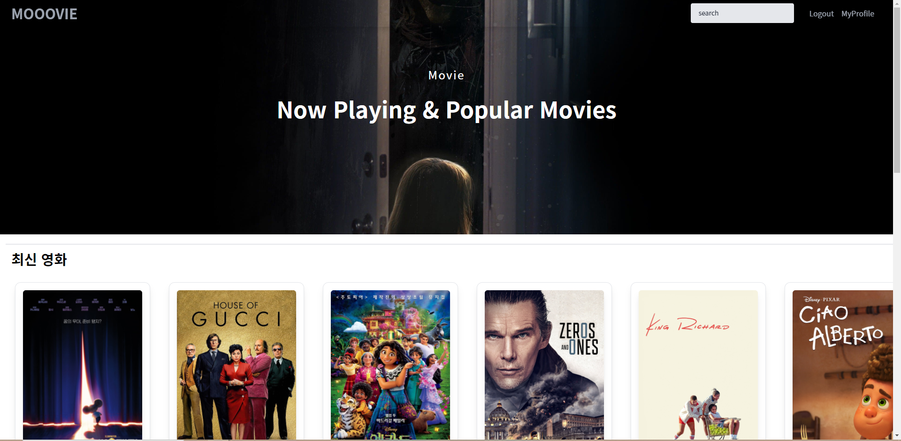
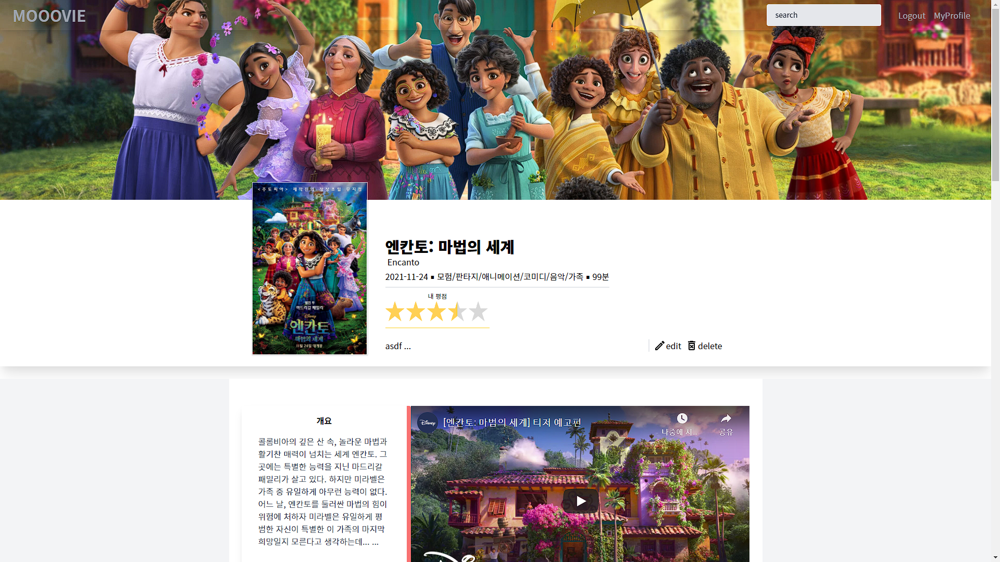
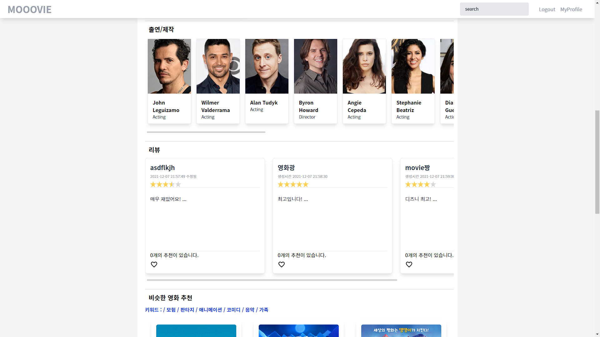
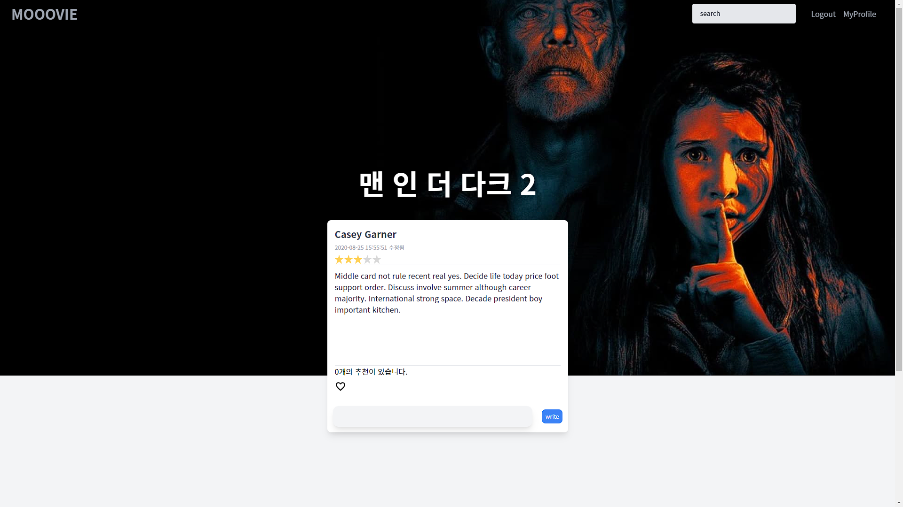
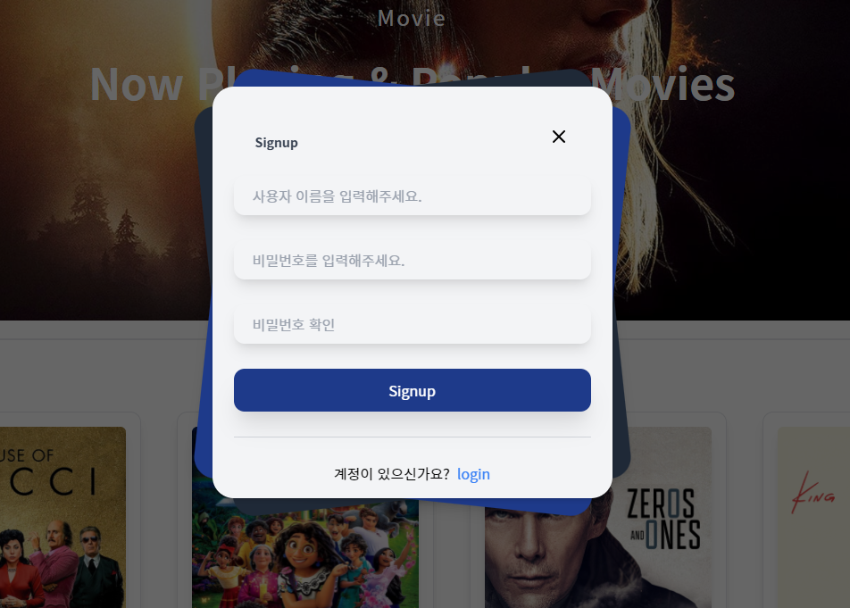
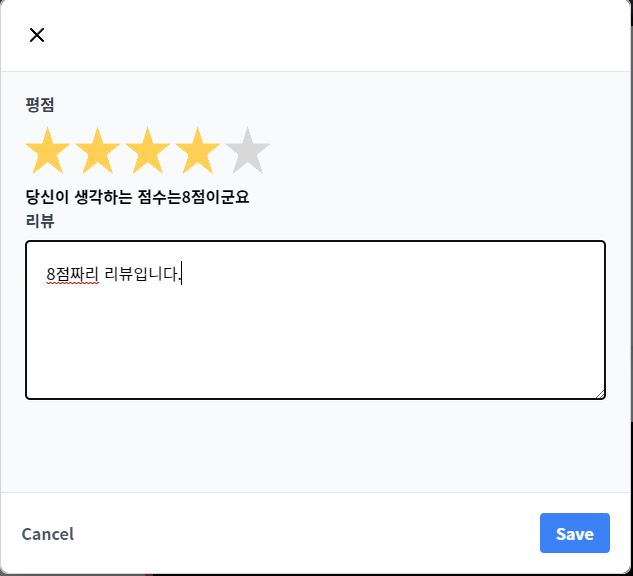
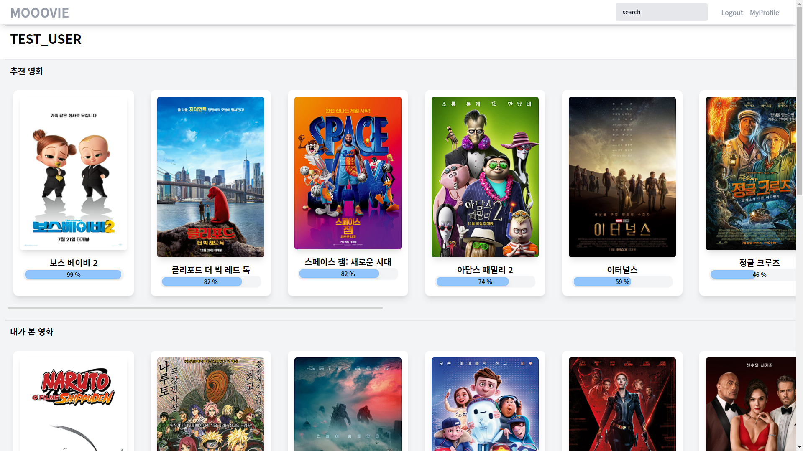
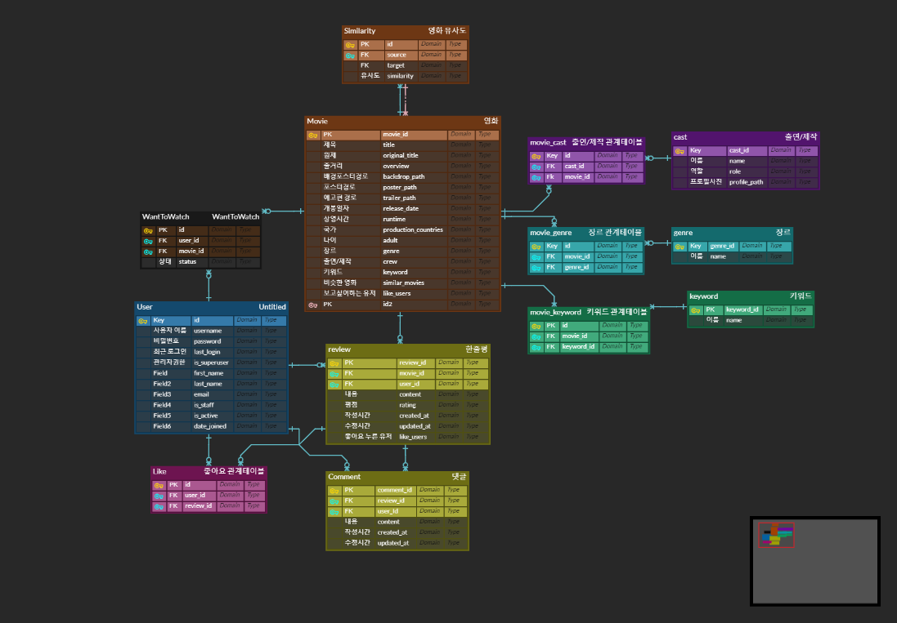
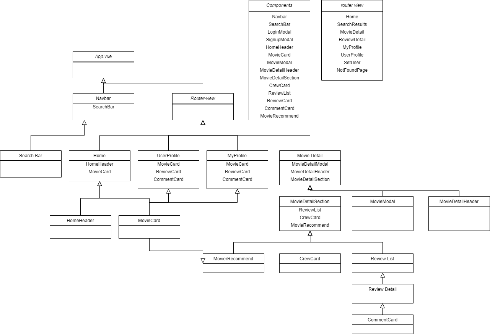
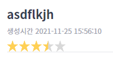

# PJT FINAL  - 영화 커뮤니티 웹 프로젝트

### 영화 정보

**TMDB API 활용** 

- MOVIES 관련 API 에서 `Get Now Playing`, `Get Details`, `Get Credits`, `Get Videos`, `Get Keywords` API 를 사용했습니다. 

1. `Get Now Playing` 으로 현재 상영 영화의 id 를 100 개 정도 가져옵니다.
2. 위에서 설명한 API 로 100 개 영화 각각에 대한 상세 정보, 장르, 출연/제작 정보, 예고편 url, 키워드 정보 등을 모두 수집합니다.
3. 수집한 데이터를 json 형식의 fixture 파일로 생성한 뒤 데이터베이스에 loaddata 합니다. => Crew, Genre, Keyword, Movies 테이블에 load
4. 추가로, 100개 영화에 대해 키워드 정보를 지닌 json 파일을 생성하여, 이를 비슷한 영화를 추출하는데 사용합니다. 

#### **메인 화면**



#### **영화 상세 정보**





#### 리뷰 상세 정보 



#### 로그인, 회원가입 모달창

  

### 커뮤니티 - review, comment CRUD 

**1. 모든 로그인 된 유저는 영화에 대한 평점 등록/수정/삭제 가능**

**2. 로그인한 사용자는 글 조회/생성 가능, 본인 글만 수정/삭제가능**

**3. 댓글 작성가능, 작성한 본인만 삭제가능**

1.    2. 

3.  

### 추천 알고리즘

**1. 비슷한 영화 추천**

- 영화 상세 페이지 (MovieDetail) 에서, 해당 영화와 키워드가 유사한 영화를 추천합니다. 

- 이를 위해 자카드 유사도를 이용하여 간단한 알고리즘을 구성했습니다. 

  - 영화의 장르와 키워드를 하나로 묶어 집합을 만들고, 다른 영화와 집합을 비교하여 그 교집합을 유사도로 나타냅니다.

  - 이렇게 얻은 영화간의 유사도를 Movie 의 self M:N 관계 테이블인 Similarity 테이블에 loaddata 하였습니다.  

**2. 유저 평점 기반 영화 추천** 

- 유저의 MyProfile 페이지에서 사용자 취향에 맞는 영화를 추천합니다. 

- 사용자가 평가한 영화(source)의 유사도를 기준으로 비슷한 영화(target)를 가져옵니다. 

- source 에 대한 사용자의 평점과 source 와 target 사이의 유사도를 곱한 값 (score) 를 기준으로 상위 영화를 가져옵니다. 

  `user rating * similarity`




## 상세 구현

###  Model ERD 작성

-  간단하게 구상하고 있는 Model ERD 를 작성한 뒤, 이후에 필요할때마다 테이블과 필드를 추가하였습니다. 



### Django 

**django-rest-auth**

- django-rest-auth 를 통해 유저 로그인, 회원가입 등의 로직을 직접 구현하지 않아도 되었음.
- Token Authentication 을 통해 특정한 요청에 대해서는 인증 여부를 확인하여 접근 제한함.

**django-seed**

- 영화 추천 시스템을 테스트하는 과정에서,  많은 수의 User 및 Review 가 필요하여 django-seed 를 사용함.
- 원하는 App 의 하위에 management/commands 폴더를 생성하고, 하위에 django seed 를 실행할 python 파일을 생성하여 manage.py 로 실행. 
- random 모듈과 faker 를 이용하여 랜덤 데이터 입력. 

**Model & Serializer**

- 응답 데이터로 반환 시, ForeignField 혹은 ManyToManyField 로 작성된 필드의 상세 정보가 필요한 경우, 

  prefetch_related 와 select_related 가 자주 사용됨. 

- prefetch 혹은 select 하기 위해선, ModelSerializer 클래스 내부에 외부키로 작성된 모델의 Serializer 작성이 추가로 필요. 
  - 원하는 데이터만 선택하여 fields 속성에 지정하면 데이터를 줄일 수 있음. 
- !! 그러나 django orm 으로 annotate  된 컬럼은 어떻게 serializer 로 serialize 하는지 모르겠음..  


### Vue

#### Component 구성 




<!-- 
####  기타 어려웠던 점.. 기억할만한 점 

**Vue3**

- deprecated 된 기능이 몇가지 있어서, 수업 때 배운 기능이 적용이 안되는 경우가 종종 있었음 
- ex) filter .. 

**Life cycle Hook**

- template 에 vue data 를 사용하는 경우, 아직 로드되지 않은 데이터에 대해 error 가 발생하는 경우가 잦음 

  - router-view 가 created 될 때 필요한 정보를 server 에 axios 요청을 보내 가져오는 경우가 많은데, 
  - axios 가 응답을 받아 데이터를 저장하기 전에, template 이 먼저 render 되어 발생하는 문제

  - template 에 v-if 로 데이터가 저장되기 전에 렌더링 되는 것을 막음

**vuex**

- 여러 컴포넌트에서 공유되는 데이터를 저장  
  - 사용자 로그인 시 사용자 정보 저장  
  - 새로운 리뷰 생성 시, 생성 된 리뷰를 바로 필요한 다른 컴포넌트로 전달하는 등등 
-   ..?

**vue-star-rating**

- vue-star-rating 라이브러리 사용 

 

- 별점을 표시에 이용,  rating 데이터와 바인딩해서 사용자가 별을 클릭 시 별점을 저장할 수 있도록 함.

```vue
<star-rating :increment="0.5" :show-rating="false" :rating="rating" @update:rating="rating = $event">
</star-rating>
```

**기타 어려웠던 점 **

- 특정 컴포넌트에서 리뷰를 생성, 수정, 삭제 시, 다른 컴포넌트의 리뷰 데이터도 변경되어야 하는데 단순히 변경이 되지 않아서 고치는 데 조금 애를 먹음

  

#### **HTML, CSS, JS**

**tailwind css**

- bootstrap 대신 커스터마이징이 간편한 tainwind css 를 사용함. 

- tailwind.config.js 에서 responsive screen 도 커스터마이징이 가능함. 

- 특정 컴포넌트에서는 bootstrap 을 사용하는 것도 가능함.

  ```vue
  <style scoped src="../assets/bootstrap.min.css">
  </style>
  ```

**HTML CSS**

- `` 를 다룰 때 크기 조절 등에 어려움을 겪어서,  `<div>`  에 background image 로 넣는 방법을 많이 사용함. 

```vue
<div class="absolute" :style="{ 'background-image': 'url(' + getBackdropImgUrl + ')' }"></div>
```


 -->


