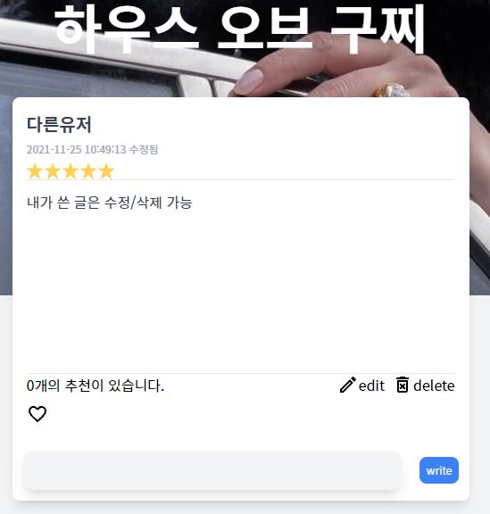
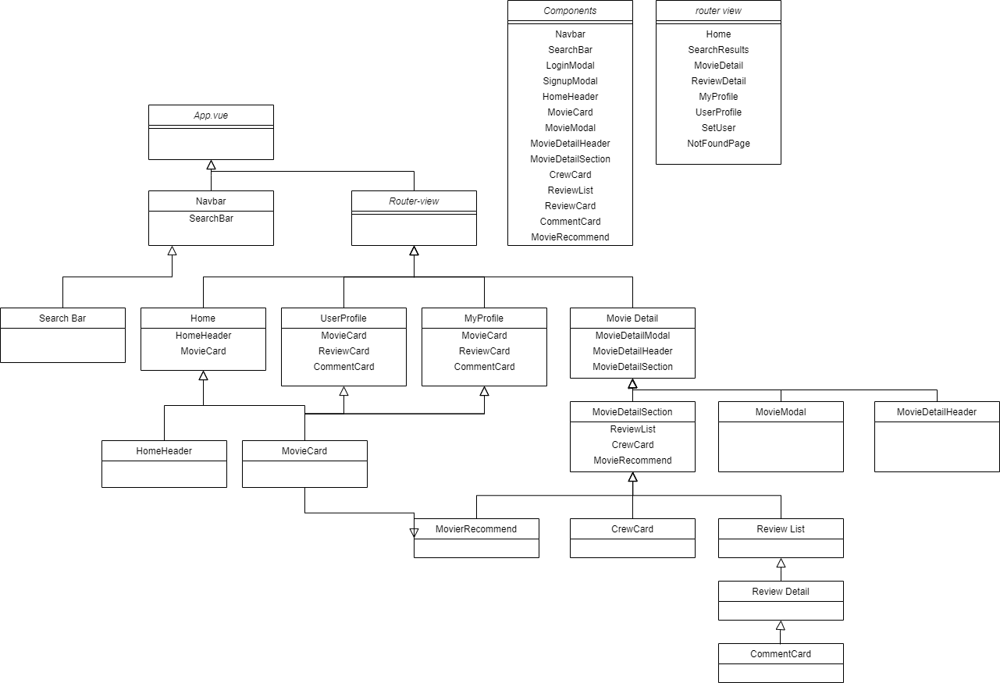
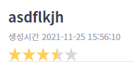

# PJT FINAL  - 영화 커뮤니티 웹 제작

## 팀원 정보 및 업무 분담 내역 

**팀원 정보**

- 홍종규 : 팀장 
- 박지후 

**업무 분담 내역**

* 하루의 시작에 구현할 기능을 하나씩 맡아, 각자 코드를 작성합니다.
* Notion 에서 체크리스트를 생성하여 활용합니다. 

 

* 같이 의논해서 결정해야할 사항이 생기면 디스코드로 바로바로 의견을 나누며 진행합니다. 
  * 구현이 어렵거나 디버깅이 도저히 안되면 페어프로그래밍 처럼 화면을 공유해서 문제를 해결합니다. 
* 일정 시간이 지나면 각자 구현한 내용을 공유하고 하나로 합친 뒤 문제가 없는지 확인합니다.

## 목표 서비스 구현 및 실제 구현 정도

* 명세서에서 제시한 항목을 완성하는것이 목표였으며 진행하면서 필요한 기능을 추가하며 진행하였습니다.

### 영화 정보

**TMDB API 활용** 

- MOVIES 관련 API 에서 `Get Now Playing`, `Get Details`, `Get Credits`, `Get Videos`, `Get Keywords` API 를 사용했습니다. 

1. `Get Now Playing` 으로 현재 상영 영화의 id 를 100 개 정도 가져옵니다.
2. 위에서 설명한 API 로 100 개 영화 각각에 대한 상세 정보, 장르, 출연/제작 정보, 예고편 url, 키워드 정보 등을 모두 수집합니다.
3. 수집한 데이터를 json 형식의 fixture 파일로 생성한 뒤 데이터베이스에 loaddata 합니다. => Crew, Genre, Keyword, Movies 테이블에 load
4. 추가로, 100개 영화에 대해 키워드 정보를 지닌 json 파일을 생성하여, 이를 비슷한 영화를 추출하는데 사용합니다. 

### 커뮤니티 - review, comment CRUD 

**1. 모든 로그인 된 유저는 영화에 대한 평점 등록/수정/삭제 가능**

 

**2. 로그인한 사용자는 글 조회/생성 가능, 본인 글만 수정/삭제가능**

 

**3. 댓글 작성가능, 작성한 본인만 삭제가능**

 


### 추천 알고리즘

**1. 비슷한 영화 추천**

- 영화 상세 페이지 (MovieDetail) 에서, 해당 영화와 키워드가 유사한 영화를 추천합니다. 

- 이를 위해 자카드 유사도를 이용하여 간단한 알고리즘을 구성했습니다. 

  - 영화의 장르와 키워드를 하나로 묶어 집합을 만들고, 다른 영화와 집합을 비교하여 그 교집합을 유사도로 나타냅니다.

  - 이렇게 얻은 영화간의 유사도를 Movie 의 self M:N 관계 테이블인 Similarity 테이블에 loaddata 하였습니다.  

**2. 유저 평점 기반 영화 추천** 

- 유저의 MyProfile 페이지에서 사용자 취향에 맞는 영화를 추천합니다. 

- 사용자가 평가한 영화(source)의 유사도를 기준으로 비슷한 영화(target)를 가져옵니다. 

- source 에 대한 사용자의 평점과 source 와 target 사이의 유사도를 곱한 값 (score) 를 기준으로 상위 영화를 가져옵니다. 

  `user rating * similarity`


## 상세 구현

###  Model ERD 작성

-  간단하게 구상하고 있는 Model ERD 를 작성한 뒤, 이후에 필요할때마다 테이블과 필드를 추가하였습니다. 


### Django 

**django-rest-auth**

- django-rest-auth 를 통해 유저 로그인, 회원가입 등의 로직을 직접 구현하지 않아도 되었음.
- Token Authentication 을 통해 특정한 요청에 대해서는 인증 여부를 확인하여 접근 제한함.

**django-seed**

- 영화 추천 시스템을 테스트하는 과정에서,  많은 수의 User 및 Review 가 필요하여 django-seed 를 사용함.
- 원하는 App 의 하위에 management/commands 폴더를 생성하고, 하위에 django seed 를 실행할 python 파일을 생성하여 manage.py 로 실행. 
- random 모듈과 faker 를 이용하여 랜덤 데이터 입력. 

**Model & Serializer**

- 응답 데이터로 반환 시, ForeignField 혹은 ManyToManyField 로 작성된 필드의 상세 정보가 필요한 경우, 

  prefetch_related 와 select_related 가 자주 사용됨. 

- prefetch 혹은 select 하기 위해선, ModelSerializer 클래스 내부에 외부키로 작성된 모델의 Serializer 작성이 추가로 필요. 
  - 원하는 데이터만 선택하여 fields 속성에 지정하면 데이터를 줄일 수 있음. 
- !! 그러나 django orm 으로 annotate  된 컬럼은 어떻게 serializer 로 serialize 하는지 모르겠음..  


### Vue

#### Component 구성 




####  기타 어려웠던 점.. 기억할만한 점 

**Vue3**

- deprecated 된 기능이 몇가지 있어서, 수업 때 배운 기능이 적용이 안되는 경우가 종종 있었음 
- ex) filter .. 

**Life cycle Hook**

- template 에 vue data 를 사용하는 경우, 아직 로드되지 않은 데이터에 대해 error 가 발생하는 경우가 잦음 

  - router-view 가 created 될 때 필요한 정보를 server 에 axios 요청을 보내 가져오는 경우가 많은데, 
  - axios 가 응답을 받아 데이터를 저장하기 전에, template 이 먼저 render 되어 발생하는 문제

  - template 에 v-if 로 데이터가 저장되기 전에 렌더링 되는 것을 막음

**vuex**

- 여러 컴포넌트에서 공유되는 데이터를 저장  
  - 사용자 로그인 시 사용자 정보 저장  
  - 새로운 리뷰 생성 시, 생성 된 리뷰를 바로 필요한 다른 컴포넌트로 전달하는 등등 
-   ..?

**vue-star-rating**

- vue-star-rating 라이브러리 사용 

 

- 별점을 표시에 이용,  rating 데이터와 바인딩해서 사용자가 별을 클릭 시 별점을 저장할 수 있도록 함.

```vue
<star-rating :increment="0.5" :show-rating="false" :rating="rating" @update:rating="rating = $event">
</star-rating>
```

**기타 어려웠던 점 **

- 특정 컴포넌트에서 리뷰를 생성, 수정, 삭제 시, 다른 컴포넌트의 리뷰 데이터도 변경되어야 하는데 단순히 변경이 되지 않아서 고치는 데 조금 애를 먹음

  

#### **HTML, CSS, JS**

**tailwind css**

- bootstrap 대신 커스터마이징이 간편한 tainwind css 를 사용함. 

- tailwind.config.js 에서 responsive screen 도 커스터마이징이 가능함. 

- 특정 컴포넌트에서는 bootstrap 을 사용하는 것도 가능함.

  ```vue
  <style scoped src="../assets/bootstrap.min.css">
  </style>
  ```

**HTML CSS**

- `` 를 다룰 때 크기 조절 등에 어려움을 겪어서,  `<div>`  에 background image 로 넣는 방법을 많이 사용함. 

```vue
<div class="absolute" :style="{ 'background-image': 'url(' + getBackdropImgUrl + ')' }"></div>
```


## 느낀점 

**홍종규**
- 마지막 관통 프로젝트인 만큼 일주일이라는 시간이 주어졌는데 일주일 동안 매일 늦게까지 개발하며 열심히
임하고 그에 대한 결과물이 마음에 들게 나와서 만족스러운 경험이었습니다.

- 초반부 서버 쪽 개발에서 생각보다 빠르게 프로젝트가 완성될 것이라고 예상했지만 클라이언트 쪽 개발에
모르는 것이 많아서 지후 님께 여쭤보며 개발하느라 딱 시간에 맞게 프로젝트가 끝난 것 같습니다. 초반에 프로젝트를
어떤 식으로 구성할지 혹은 어떤 시간 계획을 가지고 진행할지에 대한 부분이 미흡했던 것 같습니다.

- 일주일 동안 여태 배운 내용에 대해 복습을 한 것 같고 내가 무엇을 잘 모르고 있는지도 알게 된 기회였습니다.

- 후반부에 가면서 여러 가지 다양한 기능들도 개발해 보고 싶었지만 시간문제로 인하여 다 개발하지 못한
아쉬움도 있는 것 같습니다.

- 저보다 저희 팀원이신 지후 님께서 잠도 줄여가시며 고생하셔서 감사드리고 페어 프로그래밍 형식으로 프로젝트를
많이 진행하였는데 그 과정에서 배운 것이 많은 것 같아서 좋았습니다.


**박지후 **

- 일주일이 어떻게 지나갔는지도 모를 정도로 프로젝트에 시간과 열정을 많이 쏟았습니다. 

- 그동안 했던 관통 프로젝트와 거의 비슷해서, 한 본 해봤던 내용이라 생각하고 금방 끝날 거라 생각했는데, 

  생각보다 시간도 오래 걸렸고, 구현에 어려움도 있었습니다. 

- 특히 알 수 없는 에러메시지로 고민하고 있으면 시간이 너무 빨리 지나가서 시간 가는 줄 몰랐습니다.
- 그럴 때마다 같이 고민하고 해결해 줄 수 있는 팀원이 있어서 든든했고 도움을 많이 받았습니다. 감사합니다 종규님ㅎㅎ


- 그동안 배웠던 내용을 총 복습 할 수 있었던 시간이었고, 특히 오래 손을 놓고 있었던 HTML, CSS 파트를 다시 공부하면서 하느라 어려움이 많았습니다.

- 그래도 일주일 동안 복습도 많이 됐고, 그동안 몰랐던 부분도 많이 알게 되어 보람찬 시간이었던 것 같습니다. 

- 아쉬웠던 점은, 

  - 시도했지만, 능력이 부족해서 포기하거나, 디자인이 완벽히 하지 못한 부분들.. ( Bootstrap Carousel Image, vue-carousel library )

  - 처음에 구상했던 기능을 100% 모두 구현하지 못한 것들.. ( 보고싶어요 기능이라던지,, ) 

  - 처음 프로젝트를 시작할 때 목표 컨셉이나,  스케쥴 계획등을 미리 계획하지 못한점? 

    - 일단 명세에 있는 기능을 모두 구현하자는 목표로 시작했는데, 

      하다가 보니 명확한 컨셉이 없어 다른 영화 사이트와 비슷해지는 느낌을 받았는데, 그게 좀 아쉬웠습니다. 

      조금 더 특색 있는 걸 계획해 봤으면 좋았을 것 같습니다...

    - 또 많은 시간 개발을 하긴 하는데 스케줄이 정해진게 없다보니,  효율적으로 시간을 보내지 못한 것 가습니다. 

- 단순히 django, vue 말고도, 구글링 해서 오류를 해결하거나 , 데이터를 수집하고, 추천 로직을 생각해보는 등 스스로 해결해야 하는 문제들을 생각해 볼 수 있는 시간도 있어서 좋았던 것 같습니다.  
- 두서 없지만 여기서 마무리!


